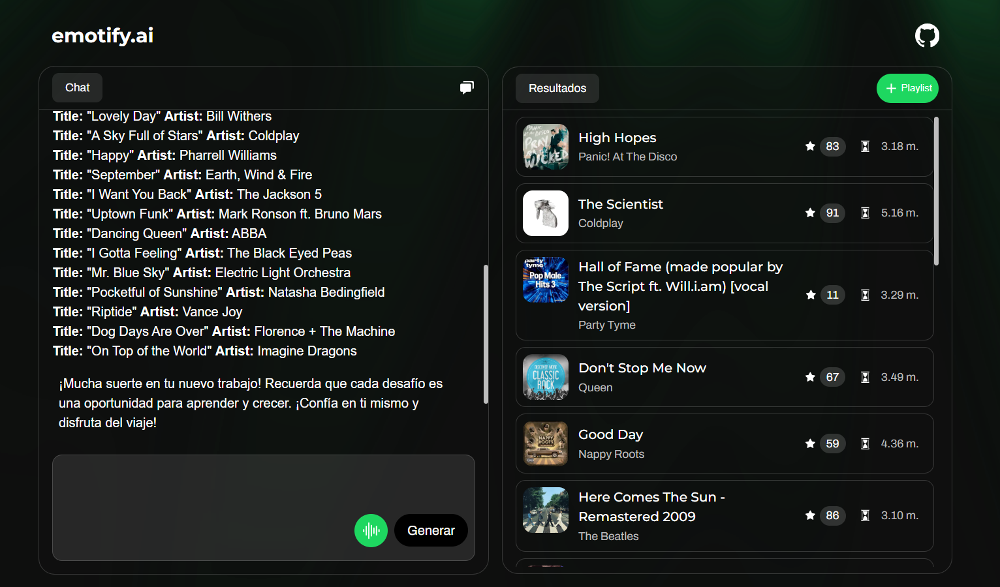

# emotify.ai


**Made with 💚 by [Sebastian Marat Urdanegui Bisalaya](https://sebastianurdanegui.vercel.app/)**.

Web application to generate a list of songs that the agent recommends based on your preferences or feelings and create a Spotify playlist in your account from these recommended songs through Gemini Flash 2.0, Next.js AI SDK, and Spotify API.




## **Tech Stack**

1. [**React**](https://react.dev/) - Open-Source JavaScript Library.
2. [**TailwindCSS**](https://tailwindcss.com/) - A utility-first CSS framework for rapidly building custom designs.
3. [**TypeScript**](https://www.typescriptlang.org/) - Programming Language that builds on JavaScript.
4. [**Zod**](https://zod.dev/) - A TypeScript-first schema validation library.
5. [**Axios**](https://axios-http.com/docs/intro) - A Promise based HTTP client for the browser and node.js.
6. [**Next.js**](https://nextjs.org/) - A React Framework for Production.
7. [**Next.js AI SDK**](https://ai-sdk.dev/) - A free open-source library for building AI-powered applications.
8. [**Spotify API**](https://developer.spotify.com/documentation/web-api/) - A REST API for interacting with the Spotify music service.

## APIs Route with Next.js

Understanding the structure of the APIs Route with Next.js in this project is crucial for the development of the application.

## **Installation**

1. **Fork this repository**
   
   Click the "Fork" button in the top right corner to create your own copy of this repo.
2. **Clone your fork locally**
```bash
git clone https://github.com/your-username/your-fork.git
cd your-fork
```
3. **Create an .env file**
   
   Create a new file named .env in the root directory of the project and add the following variables with your own values:
```bash
GOOGLE_GENERATIVE_AI_API_KEY=AbCXXXXXXXXXXXXXXyz
CLIENT_ID_SPOTIFY_API=XyzXXXXXXXXXXXXXAbC
SECRET_CLIENT_SPOTIFY_API=bCDXXXXXXXXXXXXXlMN
```
4. **Create a new branch for your changes**
```bash	
git switch -c your-feature-branch
```
5. **Make your changes and commit**
```bash	
git add .
git commit -m "Clear and concise description of your changes using the best practices"
```
6. **Push the branch to your fork**
```bash	
git push origin your-feature-branch
```
7. **Open a Pull Request**
   
   • Go to your fork on GitHub.

	 • Click on "Compare & pull request".
	 
	 • Choose the correct base (`main` on the original repo).
	 
	 • Add a description explaining what your PR does.
	 
	 • Submit the pull request.

## **Terms of Use**

1. **emotify.ai** is a web application that uses AI technology to recommend songs to the user based on their preferences or feelings. Our web application does not save any user data in our database.
2. **The user is responsible for the content of the messages they send to the AI model.** The AI model is not responsible for any damage caused by the user's messages.
3. The user can use our web application without registering or logging in (obviously, they have limited access to the Spotify API), but if they want to connect our web application to their Spotify account to create a custom playlist, they will need to provide their Spotify API credentials. Additionally, we do not store any user data in our database.

